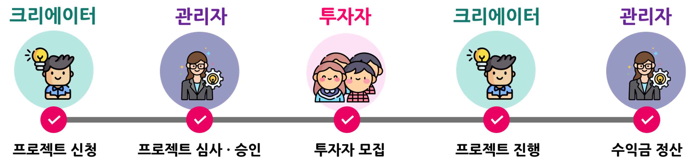
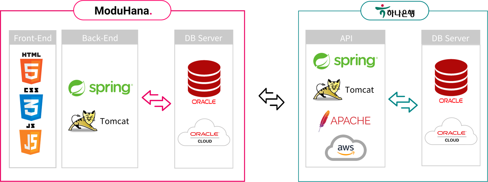

# 모두하나 - K-Contents 소액투자 플랫폼

[프로젝트 홈페이지](https://koposoftware.github.io/2022_8_ykseo/)

# 1. 프로젝트 개요

## 1-1. 프로젝트 배경
- 상대적으로 위험부담이 적은 소액투자의 인기가 증가함에 따라 크라우드 펀딩 시장이 성장하고 있습니다. 세계은행(WB)에 따르면 전세계 크라우드펀딩 시장규모는 2015년 40조원에서 2020년 100조원대까지 확대된 것으로 나타났습니다. [출처 : 2022.06.12. 이뉴스투데이]
- 한국 콘텐츠 10개 분야가 차지하는 비중이 전년보다 5.9%포인트 증가(평균 27.4%)되며, 해외 시장에서의 한국문화컨텐츠의 비중이 확대되고 있습니다. [출처 : 2022.02.14. 연합뉴스]

## 1-2. 프로젝트 개요 및 목적
- 모두하나는 K-Contents를 주력 상품으로 투자자와 크리에이터를 연결하는 크라우드 펀딩 플랫폼입니다.
- 투자를 받기 원하는 크리에이터가 투자 상품을 업로드하면, 투자자는 마음에 드는 투자 상품에 투자할 수 있습니다. 프로젝트가 종료되어 수익금이 반환되면 수익금을 정산하는 서비스를 제공합니다.
- 모두하나는 하나은행과 연계되어 계좌 개설 및 이체 등 은행 서비스 이용이 가능합니다.
- 프로젝트를 확장하여 해외 투자자를 유치하는 것이 목표입니다. 

# 2. 프로젝트 제안서
[발표자료](/2260341011_서유경_제안서.pdf) 

# 3. 프로젝트 결과
## 3-1. 모두하나 투자 프로세스
 
## 3-2. 서비스 아키텍처
 
## 3-3. 프로젝트 아키텍처
 
## 3-4. ERD
 

## 3-5. 발표 ppt 
[발표자료](/2260341011_서유경_발표자료.pptx) 

## 3-6. 시연 동영상 
<iframe style="width:100%;height:100%" src="https://www.youtube.com/embed/kIhcEC27FOY" title="한국폴리텍대학 광명융합기술교육원 2260341011 서유경 - 최종 프로젝트 시연영상" frameborder="0" allow="accelerometer; autoplay; clipboard-write; encrypted-media; gyroscope; picture-in-picture" allowfullscreen></iframe>

## 3-7. 하나은행 OPEN API 문서
- 링크 : https://summer-run-769.notion.site/HanaBank-2b896d4edcd641c584db929fc8341848
- 일부
 

## 사용기술
- OpenAPI 서버 제작 및 사용
- PL/SQL package 작성, Exception Log 기록
- Spring Framework 사용
- Spring Scheduler를 사용하여 프로젝트 변동사항 관리
- MyBatis롤 이용한 DBMS와 Application 통신
- Bootstrap을 이용한 웹 디자인
- 카카오, 네이버 API 사용
- CoolSMS 메시지 전송
- Java Mail Sender 사용

## 개발환경
- OS : Window10, Linux Ubuntu 22.04
- JDK : java 1.8
- Language : Java, jsp, html, css, javascript, SQL, PL/SQL
- IDE : Eclipse, Sql Developer
- Framework : Spring, Mybatis
- Server : Tomcat9, Oracle 19c
- SVN : Git

# 4. 본인 소개

|이름      |서유경    ||
|연락처     |이메일    |syk322(@)naver.com|
|skill set|Language|Java, Python, C, JavaScript, HTML, SQL, PL/SQL|
|         |TOOLS   |Spring, Mybatis|
|         |Database|Oracle, MySQL|
|         |Etc     |Git, Oracle Cloud, AWS, Cuda|
|자격증     |2019년   |SQLD|
|         |2022년   |정보처리기사|
|수상      |2022년   |교내 프로젝트작품 경진대회 은상 (광명융합기술교육원) |
|         |2022년   |한국폴리텍대학 벤처창업아이템경진대회 입선 (고용노동부 후원)  |

